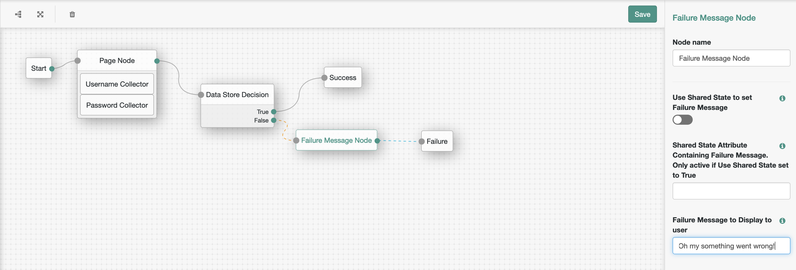
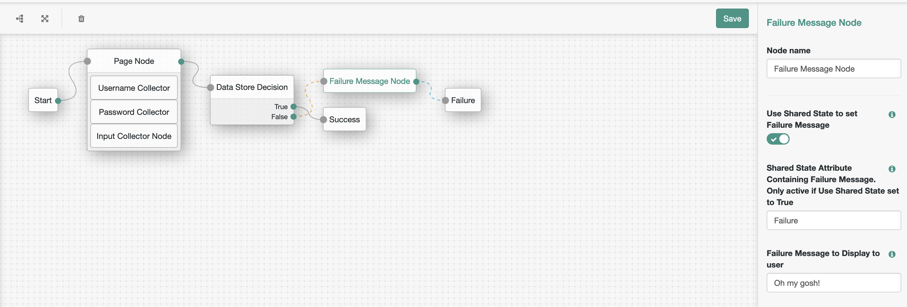

<!--
 * The contents of this file are subject to the terms of the Common Development and
 * Distribution License (the License). You may not use this file except in compliance with the
 * License.
 *
 * You can obtain a copy of the License at legal/CDDLv1.0.txt. See the License for the
 * specific language governing permission and limitations under the License.
 *
 * When distributing Covered Software, include this CDDL Header Notice in each file and include
 * the License file at legal/CDDLv1.0.txt. If applicable, add the following below the CDDL
 * Header, with the fields enclosed by brackets [] replaced by your own identifying
 * information: "Portions copyright [year] [name of copyright owner]".
 *
 * Copyright 2019 ForgeRock AS.
-->
# FailureMessage Node

A simple authentication node for ForgeRock's [Identity Platform][forgerock_platform] 6.5.1 and above. There is currently no way to propogate custom error messages through AM's new Authentication Node architecture. 

However, on login failure the failureUrl parameter is always returned. This node sets this parameter to different values based on node specific login - either from an attribute stored in AuthN Shared State from a previous Node or from a value within the Node's configuration itself.

Copy the .jar file from the ../target directory into the ../web-container/webapps/openam/WEB-INF/lib directory where AM is deployed.  Restart the web container to pick up the new node.  The node will then appear in the authentication trees components palette.

**Usage**

The code in this repository has binary dependencies that live in the ForgeRock maven repository. Maven can be configured to authenticate to this repository by following the following [ForgeRock Knowledge Base Article](https://backstage.forgerock.com/knowledge/kb/article/a74096897).

**To Build**

The code in this repository has binary dependencies that live in the ForgeRock maven repository. Maven can be configured to authenticate to this repository by following the following ForgeRock Knowledge Base Article.

To build run mvn clean install

To configure the node to return a failure error message set from within the node configure the node as follows:

A failed login attempt will now return:

{
    "code": 401,
    "reason": "Unauthorized",
    "message": "Login failure",
    "detail": {
        "failureUrl": "Oh my something went wrong!"
    }
}

To configure the node to return a failure error message from a previous node through Shared State configure the node as follows:

        
The sample code described herein is provided on an "as is" basis, without warranty of any kind, to the fullest extent permitted by law. ForgeRock does not warrant or guarantee the individual success developers may have in implementing the sample code on their development platforms or in production configurations.

ForgeRock does not warrant, guarantee or make any representations regarding the use, results of use, accuracy, timeliness or completeness of any data or information relating to the sample code. ForgeRock disclaims all warranties, expressed or implied, and in particular, disclaims all warranties of merchantability, and warranties related to the code, or any service or software related thereto.

ForgeRock shall not be liable for any direct, indirect or consequential damages or costs of any type arising out of any action taken by you or others related to the sample code.

[forgerock_platform]: https://www.forgerock.com/platform/  
